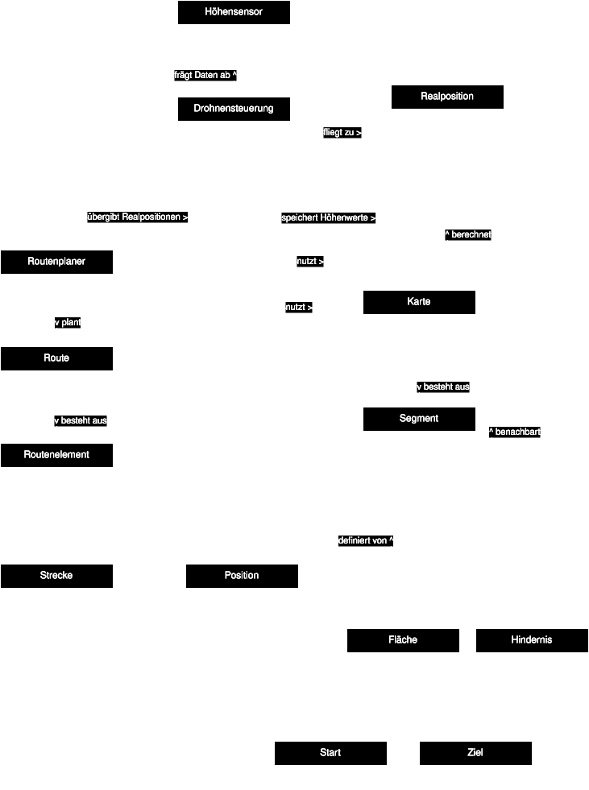
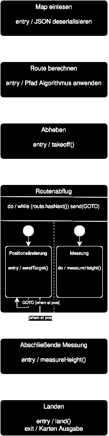
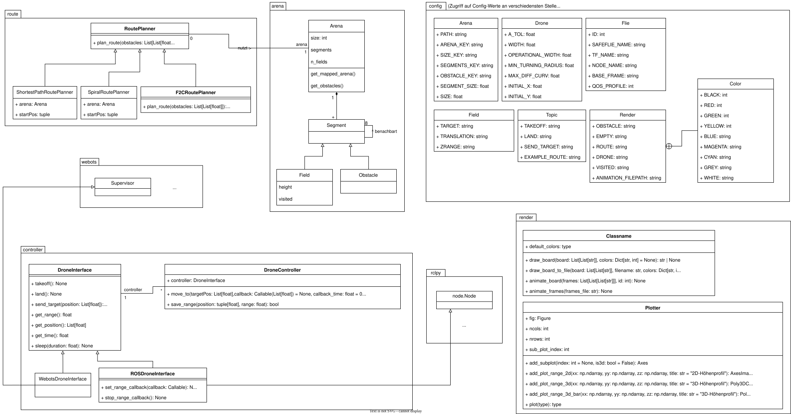

# Flugrobotik_WS202425

## Installation

> [!NOTE]  
> This setup was tested on Ubuntu.

### Prerequisites

- [ROS 2 (Humble)](https://docs.ros.org/en/humble/Installation.html)
- [DS-Crazyflies](https://github.com/DynamicSwarms/ds-crazyflies/tree/master)
- Crazyflie Client, Crazyradio etc.
- [Fields2Cover](https://fields2cover.github.io/source/installation.html)

1. Clone the project using: `git clone https://github.com/frankbits/Flugrobotik_WS202425.git`
2. Switch to the projects root directory using: `cd Flugrobotik_WS202425`
4. Source the [setup.bash](./setup/setup.bash) file using: `source ./setup/setup.bash`
5. Build the project using: `build` or `colcon build`

## Configuration

> [!IMPORTANT]  
> Whenever file or configuration changes occur, the project needs to be rebuilt!

All configuration is done through the following three files:

### [tha_framework.launch.py](./src/roboss/launch/tha_framework.launch.py)

The launch file is used when launching ROS 2 nodes and only the `launch_arguments` should be tweaked:

```python
launch_arguments={
  "id": "1", # Hardware: ?, Webots: 0
  "channel": "100", # Crazyflie Radio Frequency
  "initial_position": "[0.0, 0.0, 0.0]",
  "type": "1", # Hardware: 1, Webots: 2
}.items(),
```

### [setup.bash](./setup/setup.bash)

The setup file contains configuration values such as:

- `ROS_LOCALHOST_ONLY`: Whether the ROS node / network should be reachable for the localhost only
- `ROS_DOMAIN_ID`: ROS Domain ID
- `WEBOTS_HOME`: The Webots root directory, where `webots-controller` is located
- `CRAZYFLIE_ID`: The ID of the crazyflie drone (same as the id in the launch file)

### [Config.py](./src/roboss/roboss/config/Config.py)

The config file contains parameters in relation to:

- Arena: Deserialization, Size and Segments
- Drone: Drone specificiations used in path planning
- Flie: Drone specificiations used for ROS identifiers
- Field: Webots field configuration parameters
- Topic: ROS topic parameters
- Render: Rendering parameters

Further documentation is provided in the file itself.

## Aliases

The project provides some handy aliases for convenience.

- `takeoff`: Issues a takeoff command to the drone using ROS2 topics
- `land`: Issues a land command to the drone using ROS2 topics
- `launch-webots`: Launches the project as a ROS2 node with the Webots Gateway
- `launch-hardware`: Launches the project as a ROS2 node with the Hardware Gateway
- `run-node`: Runs the project node
- `build`: Builds the project
- `cfclient`: Launches the crazyflie cient
- `webots-controller <script>`: Launches the Webots controller with the specified Crazyflie script

## Path Planning

Different implementations of coverage path planning algorithms can be found inside the module `[route](./src/roboss/roboss/route)`.

- `F2CRoutePlanner`: Fields2Cover algorithm using brute-force swath generation and Dubin's curves for smooth turning
- `ShortestPathPlanner`: Utilizes a greedy shortest path algorithm
- `SpiralRoutePlanner`: Utilizes a spiral path for full coverage

## Launching

Assuming all configurations are done, you can launch the project directly on the Crazyflie itself or inside the Webots simulation.
Make sure that the Crazyflie is on and that the Crazyradio is plugged in and working respectively.

### Hardware (Crazyflie)

```shell
user:~$ build
user:~$ launch-hardware
user:~$ run-node
```

### Webots through ROS 2

Make sure the Webots Simulation is up and running first.

```shell
user:~$ build
user:~$ launch-webots
user:~$ run-node
```

### Webots directly

> [!WARNING]  
> Due to the differences in how ROS 2 and the Webots controller execute the main file, there might be some import errors.
> A working example for Webots, without the use of ROS 2, can be found under the branch [`main_webots`](https://github.com/frankbits/Flugrobotik_WS202425/tree/main_webots).

Make sure the Webots Simulation is up and running first.

```shell
user:~$ build
user:~$ webots-controller <your_script.py>
```

## Documentation
Documentation can be found under the [`doc`](./doc) directory and is additionally displayed here:

### Domain Diagram



### State Machine



## Class Diagram


